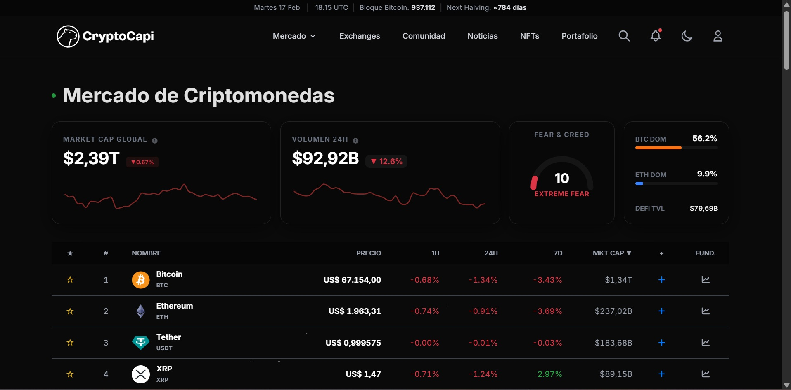
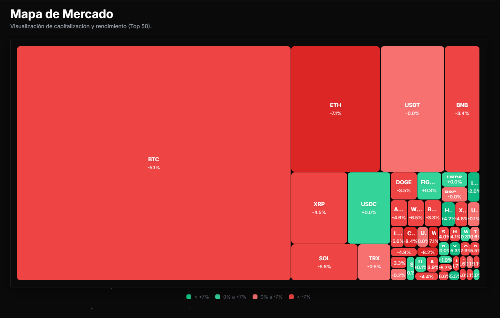
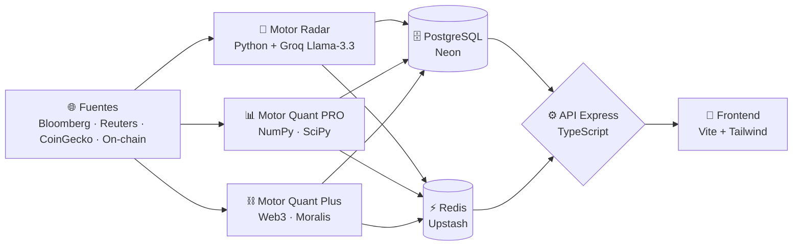

# 🐹 CryptoCapi · Terminal de Inteligencia Institucional

### *Matemática pura para decisiones cripto. Cero alucinaciones de IA.*

Plataforma de análisis de criptomonedas que **separa el análisis semántico del cálculo matemático**
a través de tres motores especializados — para que los números nunca mientan.

 

 

 
 

Terminal de mercado en tiempo real · Market Cap global · Fear &amp; Greed · dominancia BTC/ETH · ranking de activos.

---

## 🎯 El problema que resolvemos

> Los modelos de lenguaje **alucinan**. En finanzas, una alucinación cuesta dinero real.

CryptoCapi resuelve esto con una arquitectura donde la **IA solo interpreta narrativa** (noticias, sentimiento)
y **toda decisión numérica la calcula matemática verificable** — Z-Scores, filtros de Kalman, exponentes de
Lyapunov y datos on-chain leídos directamente de la blockchain.

**No te decimos qué comprar. Te damos la matemática pura para que tú decidas.**

---

## 🧠 Arquitectura · Tres Motores Especializados

| Motor | Rol | Tecnología clave |
|:---|:---|:---|
| 📡 **Motor Radar** | Ingesta noticias institucionales (Bloomberg, Reuters, Cointelegraph) y genera sentimiento + resúmenes ejecutivos sin sensacionalismo. | `Python` · `Groq Llama-3.3` · `feedparser` · `BeautifulSoup` |
| 📊 **Motor Quant PRO** | Rigor cuantitativo: Z-Score sobre 30 ventanas, filtro de Kalman para reducir ruido, exponente de Lyapunov para medir el caos del mercado y matrices de correlación de Pearson. | `NumPy` · `SciPy` · `Pandas` · `TA-Lib` |
| ⛓️ **Motor Quant Plus** | Lee la blockchain directamente: netflows de exchanges, ratios MVRV para valoración y métricas de salud de red — antes de que la información llegue al mercado. | `Web3` · `Moralis` · `WebSockets` |

---

## 🛡️ Pipeline Anti-Alucinación · Defensa en 4 Capas

> El LLM redacta la narrativa. **Python certifica los números y vigila las palabras.** La IA nunca tiene la última palabra sobre una cifra.

| Capa | Qué hace |
|:---|:---|
| **1 · Determinista** | Python calcula *todos* los valores numéricos (Bandas de Bollinger SMA-20/2σ, Z-Score logarítmico de 30 períodos, régimen de mercado) **antes** de invocar al LLM. |
| **2 · Narrativa** | Los valores deterministas se inyectan en el prompt como contexto *no negociable*; el LLM solo escribe texto sobre cifras ya fijadas. |
| **3 · Override numérico** | Tras la respuesta del LLM, Python **sobrescribe** métricas, sentiment y confidence con los valores deterministas. |
| **4 · Filtrado léxico** | Filtros deterministas eliminan frases alucinadas (p. ej. "volumen moderado", "claramente bajista") que sobrevivieron al prompt, con *gates* basados en el Z-Score y el sentiment. |

**Umbrales inmutables:** `|cambio diario| ≥ 5%` o ruptura de Bollinger → alerta de volatilidad · `|Z-Score| ≥ 3.0` → anomalía (cisne negro).

La resiliencia de IA se apoya en **cadenas de fallback multi-modelo sobre buckets de cuota independientes** con *backoff* exponencial, de modo que ningún motor agote la capacidad de otro.

---

## 📸 La Plataforma en Acción

**Mapa de Mercado** — visualización treemap de capitalización y rendimiento del Top 50 en un solo vistazo.

---

## 🛠️ Stack Tecnológico Completo

### 🎨 Frontend

> `Lightweight Charts` (TradingView) · `Swiper` · `jsVectorMap` · `Prism.js` · `DOMPurify` (sanitización XSS) · `date-fns` · `Temporal API`

### ⚙️ Backend / API

> `Helmet` · `CORS` · `express-rate-limit` · `compression` · `bcryptjs` · `Pino` (logging) · `Resend` (email transaccional) · `yahoo-finance2` · `Zod` (validación end-to-end)

### 🐍 Motor Cuantitativo (Python · Data Science)

> `TA-Lib` (análisis técnico) · `Groq` (Llama-3.3) · `Web3` · `Moralis` · `feedparser` · `BeautifulSoup4` · `cloudscraper` · `WebSockets` · `APScheduler`

### 🗄️ Datos & Persistencia

### ☁️ DevOps & Infraestructura

> Despliegue multi-servicio containerizado · `Docker Compose` (dev/staging/prod) · `Cloud Functions` · Registry `gcr.io`

### ✅ Calidad & Testing

> Tipado estricto verificado con `Mypy` · `Pyright` · `type-coverage` · análisis de código muerto con `ts-prune`

---

## 🔄 Flujo de Datos

---

## ⚖️ Principios de Ingeniería

> Reglas constitucionales que todo Pull Request debe cumplir.

- **Zero-Any** — prohibido `any` en TypeScript y Python; lo desconocido es `unknown` + *type guards*.
- **Arquitectura Hexagonal** — el dominio nunca depende de la infraestructura; cambiar la base de datos no toca la lógica de negocio.
- **Contratos compartidos** — única fuente de verdad de tipos entre frontend y backend; nadie adivina la forma de la API.
- **Cronometría determinista** — `Temporal` API (ES2025) en lugar de `Date` nativo; sin errores de zona horaria/DST en software financiero.
- **Validación paranoica** — `Zod .strict()` en el backend + `Pydantic` en el collector; validación bilateral antes de persistir.
- **Value Objects** — el dinero nunca es un `number` crudo; se encapsula inmutable para impedir estados inválidos.
- **Dependencias por arquetipo** — el motor ligero calcula sin NumPy; solo el Quant Engine carga NumPy/Kalman → imágenes Docker mínimas.
- **Gestión explícita de recursos** — `using` / `await using` (ES2025) cierran las conexiones serverless automáticamente y evitan fugas.
- **Cache-First** — Redis/Upstash con TTL delante de PostgreSQL en todo `GET` público.
- **Degradación honesta** — en modo *fallback*, la confianza reportada nunca es `HIGH`.
- **Type-safe de extremo a extremo** — verificado con `Mypy`, `Pyright` y `type-coverage`.
- **Quality Gate en CI** — GitHub Actions corre tipos, linters, tests (Jest/Pytest) y E2E (Playwright) en cada push.
- **Seguridad & observabilidad** — `Helmet`, rate limiting, sanitización XSS (DOMPurify), `bcrypt`; errores con `Sentry`, logs estructurados con `Pino`.

---

## 💡 Filosofía

> ### *"Nosotros no te decimos qué comprar.*
> ### *Te damos la matemática pura para que tú decidas."*

 

**Líder de proyecto:** Jesús González · [@Jegoba90](https://github.com/Jegoba90)

 

 

