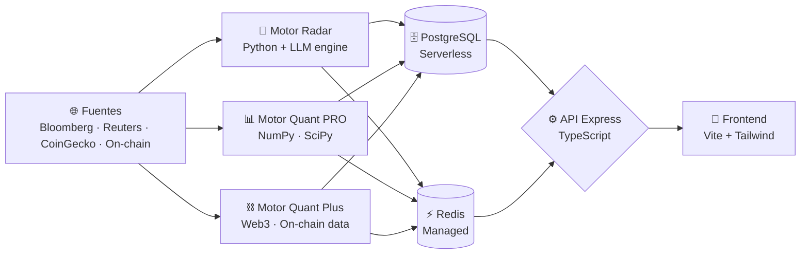

<div align="center">

<picture>
  <source media="(prefers-color-scheme: dark)" srcset="assets/logo-white.png">
  
</picture>

# CryptoCapi · Terminal de Inteligencia Institucional

### *Matemática pura para decisiones cripto. Cero alucinaciones de IA.*

Plataforma de análisis de criptomonedas que **separa el análisis semántico del cálculo matemático**
a través de tres motores especializados, para que los números nunca mientan.

<br/>


<br/>


</div>

---

## 🎯 El problema que resolvemos

> Los modelos de lenguaje **alucinan**. En finanzas, una alucinación cuesta dinero real.

CryptoCapi resuelve esto con una arquitectura donde la **IA solo interpreta narrativa** (noticias, sentimiento)
y **toda decisión numérica la calcula matemática verificable** — Z-Scores, filtros de Kalman, exponentes de
Lyapunov y datos on-chain leídos directamente de la blockchain.

<div align="center">

**No te decimos qué comprar. Te damos la matemática pura para que tú decidas.**

</div>

---

## 🧠 Arquitectura · Tres Motores Especializados

| Motor | Rol | Tecnología clave |
|:---|:---|:---|
| 📡 **Motor Radar** | Ingesta noticias institucionales (Bloomberg, Reuters, Cointelegraph) y genera sentimiento + resúmenes ejecutivos sin sensacionalismo. | `Python` · `LLM engine (multi-model)` · `feedparser` · `BeautifulSoup` |
| 📊 **Motor Quant PRO** | Rigor cuantitativo: Z-Score sobre múltiples ventanas temporales, filtro de Kalman para reducir ruido, exponente de Lyapunov para medir el caos del mercado y matrices de correlación de Pearson. | `NumPy` · `SciPy` · `Pandas` · `TA-Lib` |
| ⛓️ **Motor Quant Plus** | Lee la blockchain directamente: netflows de exchanges, ratios MVRV para valoración y métricas de salud de red — antes de que la información llegue al mercado. | `Web3` · `Web3 data provider` · `WebSockets` |

---

## 🛡️ Pipeline Anti-Alucinación · Defensa en 4 Capas

> El LLM redacta la narrativa. **Python certifica los números y vigila las palabras.** La IA nunca tiene la última palabra sobre una cifra.

| Capa | Qué hace |
|:---|:---|
| **1 · Determinista** | Python calcula *todos* los valores numéricos (Bandas de Bollinger, Z-Score logarítmico, régimen de mercado) **antes** de invocar al LLM. |
| **2 · Narrativa** | Los valores deterministas se inyectan en el prompt como contexto *no negociable*; el LLM solo escribe texto sobre cifras ya fijadas. |
| **3 · Override numérico** | Tras la respuesta del LLM, Python **sobrescribe** métricas, sentiment y confidence con los valores deterministas. |
| **4 · Filtrado léxico** | Filtros deterministas eliminan frases alucinadas que sobrevivieron al prompt, usando *gates* basados en Z-Score y sentiment. |

**Umbrales inmutables:** cambios de volatilidad extrema o rupturas de bandas estadísticas disparan alertas automáticas. Anomalías de mercado se detectan mediante umbrales de Z-Score calibrados sobre datos históricos.

La resiliencia de IA se apoya en **cadenas de fallback multi-modelo sobre buckets de cuota independientes** con *backoff* exponencial, de modo que ningún motor agote la capacidad de otro.

---

## 🛠️ Stack Tecnológico Completo

### 🎨 Frontend


> `Lightweight Charts` (TradingView) · `Swiper` · `jsVectorMap` · `Prism.js` · `DOMPurify` (sanitización XSS) · `date-fns` · `Temporal API`

### ⚙️ Backend / API


> `Helmet` · `CORS` · `express-rate-limit` · `compression` · `bcryptjs` · `Pino` (logging) · `email transaccional` · `yahoo-finance2` · `Zod` (validación end-to-end)

### 🐍 Motor Cuantitativo (Python · Data Science)


> `TA-Lib` (análisis técnico) · `LLM engine (multi-model)` · `Web3` · `Web3 data provider` · `feedparser` · `BeautifulSoup4` · `cloudscraper` · `WebSockets` · `APScheduler`

### 🗄️ Datos & Persistencia


> PostgreSQL serverless · Redis gestionado · arquitectura cache-first con TTL

### ☁️ DevOps & Infraestructura


> Despliegue multi-servicio containerizado · `Docker Compose` (dev/staging/prod) · `Cloud Functions` · Container Registry

### ✅ Calidad & Testing


> Tipado estricto verificado con `Mypy` · `Pyright` · `type-coverage` · análisis de código muerto con `ts-prune`

---

## 🔄 Flujo de Datos



---

## ⚖️ Principios de Ingeniería

> Reglas constitucionales que todo Pull Request debe cumplir.

- **Zero-Any** — prohibido `any` en TypeScript y Python; lo desconocido es `unknown` + *type guards*.
- **Arquitectura Hexagonal** — el dominio nunca depende de la infraestructura; cambiar la base de datos no toca la lógica de negocio.
- **Contratos compartidos** — única fuente de verdad de tipos entre frontend y backend; nadie adivina la forma de la API.
- **Cronometría determinista** — `Temporal` API (ES2025) en lugar de `Date` nativo; sin errores de zona horaria/DST en software financiero.
- **Validación paranoica** — `Zod .strict()` en el backend + `Pydantic` en el collector; validación bilateral antes de persistir.
- **Value Objects** — el dinero nunca es un `number` crudo; se encapsula inmutable para impedir estados inválidos.
- **Dependencias por arquetipo** — el motor ligero calcula sin NumPy; solo el Quant Engine carga NumPy/Kalman → imágenes Docker mínimas.
- **Gestión explícita de recursos** — `using` / `await using` (ES2025) cierran las conexiones serverless automáticamente y evitan fugas.
- **Cache-First** — Redis gestionado con TTL delante de PostgreSQL en todo `GET` público.
- **Degradación honesta** — en modo *fallback*, la confianza reportada nunca es `HIGH`.
- **Type-safe de extremo a extremo** — verificado con `Mypy`, `Pyright` y `type-coverage`.
- **Quality Gate en CI** — GitHub Actions corre tipos, linters, tests (Jest/Pytest) y E2E (Playwright) en cada push.
- **Seguridad & observabilidad** — `Helmet`, rate limiting, sanitización XSS (DOMPurify), `bcrypt`; error monitoring y logs estructurados.

---

## 🔬 Outputs de ejemplo · Qué devuelve cada motor

> Respuestas reales del sistema sobre **BTC · 2026-05-25**. Los datos de entrada, umbrales internos y pesos de indicadores no se publican.

<details>
<summary>📡 Motor Radar — Sentimiento institucional</summary>

```json
{
  "status": "success",
  "version": "1.0.0",
  "timestamp": "2026-05-25T19:01:32.991Z",
  "data": {
    "engine_used": "radar",
    "asset": { "id": "bitcoin", "symbol": "BTC" },
    "summary": "Lateralización de rango.",
    "sentiment": "neutral",
    "statistical_anomaly_detected": false,
    "confidence": {
      "score": 0.61,
      "label": "MEDIUM"
    },
    "math_diagnostics": {
      "z_score": -0.1598,
      "bollinger_bandwidth": 0.012,
      "market_regime": "RANGING_CHOP",
      "extreme_volatility_detected": false,
      "data_quality": "PARTIAL",
      "sentiment_override": false,
      "anomaly_details": null
    },
    "analysis": {
      "detailed_report": "El activo opera en un rango lateral, con el precio cerca de la banda inferior de soporte. La volatilidad es moderada. El régimen de mercado sugiere una fase de indecisión.",
      "sources_verified": [
        {
          "title": "Bitcoin, crypto prices tick up as US-Iran peace deal odds climb",
          "url": "https://www.coindesk.com/markets/2026/05/25/...",
          "credibility": "Tier 1"
        },
        {
          "title": "Now You Can Buy Bitcoin, XRP and More in ChatGPT via MoonPay",
          "url": "https://decrypt.co/368875/...",
          "credibility": "Tier 2"
        }
      ],
      "sources_window": "24h"
    }
  }
}
```

</details>

<details>
<summary>📊 Motor Quant PRO — Análisis cuantitativo multi-timeframe</summary>

```json
{
  "status": "success",
  "version": "1.0.0",
  "timestamp": "2026-05-25T20:18:36.005Z",
  "data": {
    "asset": { "id": "bitcoin", "symbol": "BTC" },
    "resolved_signal": "NEUTRAL_CHOP",
    "resolved_score": 52,
    "mir_diagnostics": {
      "base_raw_score": 55,
      "chaos_penalty_applied": true,
      "explanation": "Convicción direccional contraída por régimen de caos sistémico detectado."
    },
    "macro_1d": {
      "timeframe": "1d",
      "confluence_score": 55,
      "signal": "NEUTRAL_CHOP",
      "regime": {
        "lyapunov": 1.893,
        "status": "CHAOTIC",
        "signal_confidence": "LOW"
      }
    },
    "micro_4h": {
      "timeframe": "4h",
      "confluence_score": 60,
      "signal": "NEUTRAL_CHOP",
      "regime": {
        "lyapunov": 2.031,
        "status": "CHAOTIC",
        "signal_confidence": "LOW"
      }
    }
  }
}
```

</details>

<details>
<summary>⛓️ Motor Quant Plus — Datos on-chain</summary>

```json
{
  "status": "success",
  "version": "1.0.0",
  "timestamp": "2026-05-25T20:17:29.969Z",
  "data": {
    "engine_used": "quant_plus",
    "asset": { "id": "bitcoin", "symbol": "BTC" },
    "summary": "Equilibrio técnico.",
    "sentiment": "neutral",
    "statistical_anomaly_detected": false,
    "confidence": {
      "score": 0.61,
      "label": "MEDIUM"
    },
    "onchain_stats": {
      "network": "bitcoin-mainnet",
      "network_congestion": "LOW",
      "whale_activity_alert": true,
      "onchain_confidence_score": 0.9
    },
    "actionable_insight": {
      "signal": "HOLD",
      "risk_level": "LOW"
    },
    "math_diagnostics": {
      "z_score": 0.1705,
      "bollinger_bandwidth": 0.0988,
      "market_regime": "RANGING_CHOP",
      "extreme_volatility_detected": false,
      "data_quality": "OPTIMAL",
      "sentiment_override": false,
      "anomaly_details": null
    },
    "analysis": {
      "detailed_report": "Régimen de mercado: lateralización. Precio opera en el tercio inferior de las bandas de Bollinger. Z-Score (0.17) en zona neutral — sin anomalías estadísticas."
    }
  }
}
```

</details>

---

<div align="center">

## 💡 Filosofía

> ### *"Nosotros no te decimos qué comprar.*
> ### *Te damos la matemática pura para que tú decidas."*

<br/>

**Líder de proyecto:** Jesús González · [@Jegoba90](https://github.com/Jegoba90)

<br/>


<br/>


</div>
